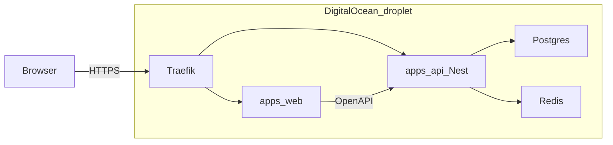

# Intra stack rewrite (before expansion)

## Recommendation

**Rewrite now on your DigitalOcean droplet:** keep the React/TanStack UI; replace Supabase entirely with NestJS + Drizzle + Postgres + Redis, all running as Docker services behind Traefik (same pattern as today’s staging). Do not expand product features until that stack is live.

**No hybrid. No dual-run on Supabase.** Build the new stack, one-shot migrate data, cut DNS/traffic over, shut down the Supabase project.

**Security fixes are in-scope**, mapped from the full-repo security audit (findings C1-L3 in the table below).

### Locked decisions

- **Hosting:** Existing DO droplet — `web`, `api`, `postgres`, `redis`, Traefik (HTTPS). Same host already runs Traefik and other apps; use a distinct Compose project name (as with `ops-test`).
- **Auth:** Nest-owned (session cookie preferred); invite-only / admin-provisioned ops users; **no Supabase Auth**.
- **DB:** Postgres **container on the droplet** (volume + backups). Not Supabase-hosted Postgres. Not a separate managed DB unless you later choose one for ops convenience.
- **Repo:** Monorepo `apps/web` + `apps/api`.
- **Lovable / Supabase:** Disconnected; git + Docker only after cutover.

## Target architecture

| Keep | Replace / leave |
|------|-----------------|
| React 19, TanStack Router/Query/Start, Tailwind 4, Radix/shadcn | Browser → Supabase CRUD |
| Domain model / routes / workflows in UI | Supabase Auth + RLS |
| Traefik + Docker on DO droplet | Lovable Cloud |
| Schema intent from existing SQL migrations | [`src/integrations/supabase/*`](src/integrations/supabase), [`src/lib/db.ts`](src/lib/db.ts) client |

## Why this order (and why the droplet)

1. Security Critical/High issues are structural to “browser + open RLS”; a BFF on infra you control fixes trust once.
2. Your preferred stack already assumes Node + Docker + Traefik — the droplet is the natural home; paying Supabase while also running Nest/Postgres elsewhere is waste and coupling.
3. Frontend is already aligned — rewrite cost is API, data, auth, deploy — not a UI framework swap.
4. One host you already operate (`ops-test` / Traefik) keeps staging simple; isolate with Compose project names so other sites on the droplet stay untouched.

**Ops note (not a stack change):** Postgres-in-Docker on a single droplet is fine for staging/early prod if you add **scheduled volume backups** (and test restore). Revisit managed Postgres only if you outgrow that.

## Security findings → plan mapping

| ID | Severity | Finding | How / when fixed |
|----|----------|---------|------------------|
| C1 | Critical | Open signup + full-table access for any authenticated user | Phase 2: invite-only Nest auth + guards. Phase 4: remove public signup UI. |
| H1 | High | `.env` committed; not in `.gitignore` | Phase 0: gitignore, untrack, `.env.example`. Secrets only on droplet / secret store. |
| H2 | High | RLS is auth-only, not authorization | Phase 2: Nest is sole authz; Postgres not exposed to browser. |
| M1 | Medium | Comment author spoof / any-user delete | Phase 2: `authorId` from session; scoped update/delete. |
| M2 | Medium | Raw `documents_url` href XSS | Phase 2: http(s) only on write. Phase 4: same on render. |
| M3 | Medium | Infra fingerprints in docs | Phase 0: redact IPs/paths/project ids from git docs. |
| L1 | Low | Password min length 6 | Phase 2: stronger password policy. |
| L2 | Low | Unused service-role client footgun | Phase 4: delete all Supabase integrations; no admin DB creds in web env. |
| L3 | Low | No security headers | Phase 1/5: Traefik and/or Nest headers (CSP, frame-ancestors, Referrer-Policy, HSTS). |

## Phased work

### Phase 0 — Freeze and baseline (+ secrets hygiene)

- Freeze Lovable/Supabase feature work.
- Draft Drizzle schema from [`supabase/migrations/`](supabase/migrations/).
- Inventory `db.from(...)` / `supabase.auth` call sites.
- **H1:** `.env` → `.gitignore`; untrack; add `.env.example`.
- **M3:** Redact host fingerprints from [`PROJECT.md`](PROJECT.md).

### Phase 1 — Monorepo + droplet Compose

- `apps/web`, `apps/api`, optional `packages/shared`.
- Compose services: `web`, `api`, `postgres`, `redis` (+ Traefik labels / external Traefik network as on the droplet today).
- **L3:** Security headers at Traefik (and Nest as needed).
- Web env: public API URL only — never Postgres credentials.

### Phase 2 — Nest API (parity + authz)

- Auth: invite-only ops; httpOnly secure session cookie preferred; strong passwords.
- Domain modules: Staff, Centres, Availability, Shifts (assign/contacted/Staffpoint/comments/channels/contacts), Profiles (self only).
- Jobs: Nest cron for shift auto-complete (replaces `pg_cron`).
- Guards for all data routes; comment authorship rules; http(s) URL validation.
- Swagger/OpenAPI from day one.

### Phase 3 — Migrate onto droplet Postgres

- Apply Drizzle migrations to droplet Postgres.
- One-shot import from current Supabase data → droplet; remap users (re-invite ops if password hashes don’t migrate cleanly).
- **Cut over once** — no prolonged read/write on both systems.
- After cutover, decommission Supabase (Auth + hosted DB).

### Phase 4 — Web → Nest

- API client + React Query; remove Supabase client and signup UI.
- Harden `documents_url` rendering; delete [`src/integrations/supabase/`](src/integrations/supabase/).

### Phase 5 — Staging on droplet

- Deploy Compose project for Intra behind Traefik (`ops-test.intra.ca` or chosen host).
- Parity QA + security checklist (401 unauthenticated, no signup, author spoof fails, bad URLs rejected, headers present, no secrets in git/images).
- Confirm other droplet apps (`usa.intra.ca`, etc.) unaffected.

### Security closeout

- Mark C1–L3 closed or accepted residual; document invite-only ops model without re-adding infra fingerprints to git.

## Explicitly out of scope (until rewrite is done)

- Staff self-service, WhatsApp/GoTo, role hierarchy, reporting, document upload, distance sorting.
- Mobile-first / customer-facing redesign.
- Vite major version churn.
- Keeping or hardening Supabase for any ongoing environment.

## Success criteria

- Entire runtime on the DO droplet: web, api, postgres, redis, Traefik.
- Zero browser → database access; zero Supabase dependency in code or deploy.
- No public self-signup; only provisioned ops users.
- Feature parity with current ops MVP on staging.
- `.env` not in git; deploy artifacts in repo.
- Audit findings C1–L3 closed or documented as accepted residual.

## Immediate next step after you approve

Phase 0 secret hygiene + monorepo/Compose skeleton targeting the droplet, then Nest + Drizzle with **Staff** end-to-end before bulk-porting the rest.
